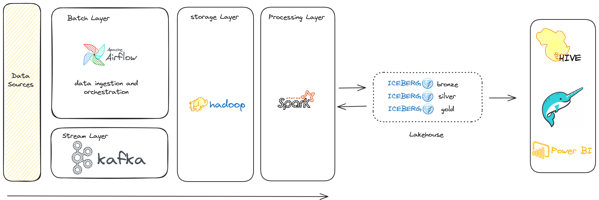
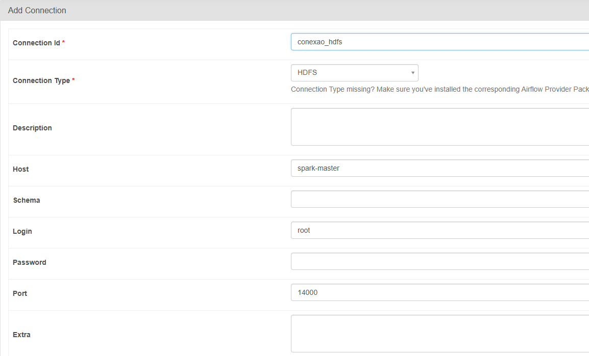

# Data Lakehouse Open Source
> Este projeto visa implementar uma arquitetura de dados para big data que suporte um ambiente de data lakehouse utilizando apenas softwares abertos.

## Arquitetura Proposta

## Pré-Requisitos
 Docker
 Docker Compose

## Como Executar esse Projeto
- Realize o build dos containers:    
`docker compose build`

- Inicie os containers do projeto:    
`docker compose up -d --scale spark-worker=3`

> Escolha a quantidade de nós do spark de acordo com sua capacidade de execução dos containers.

- Para submeter uma aplicação:
`docker exec cluster-spark-master spark-submit --master yarn --deploy-mode cluster ./apps/nome_aplicacao.py`

- Acesse os serviços via navegador:
  - **YARN:** http://localhost:8088
  - **HDFS:** http://localhost:14000
  - **AIRFLOW:** http://localhost:14000
  - **ZEPPELIN:** http://localhost:9080
  - **SPARK HISTORY:** http://localhost:18080

>> Para executar a dag de ingestão do airflow, criar a conexão com o webhdfs

- Para desligar o cluster:    
`docker compose down`

## Referências
https://hadoop.apache.org/docs/r3.3.6/hadoop-project-dist/hadoop-common/ClusterSetup.html
https://hadoop.apache.org/docs/r3.3.6/hadoop-project-dist/hadoop-hdfs/hdfs-default.xml
https://hadoop.apache.org/docs/r3.3.6/hadoop-yarn/hadoop-yarn-common/yarn-default.xml
https://zeppelin.apache.org/docs/0.11.1/setup/deployment/spark_cluster_mode.html#spark-on-yarn-mode
https://github.com/apache/airflow/issues/8198